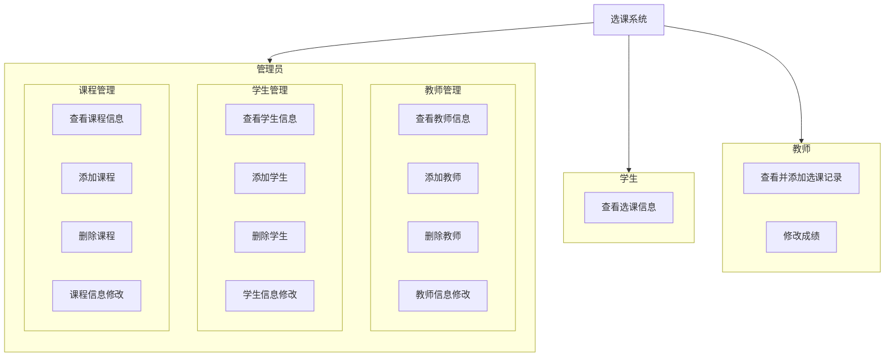

### 学校选课系统的设计与实现

#### 目录

[TOC]

#### 正文

##### 1. 引言

###### 1.2 设计目的

​	设计一个学校选课系统，包括课程信息管理、学生信息管理、选课管理等功能。课程信息管理负责课程的添加、修改和查询；学生信息管理负责学生的添加、修改和查询；选课管理负责学生选课的操作和查询。

###### 1.3 要求

​	除了实现选课系统的基本功能之外，还需要体现系统中对数据库安全性，完整性的保护。最后还需要一个较为友好的用户界面。

###### 1.4 设计环境

- MYSQL Ver 8.0.35-0ubuntu0.22.04.1 for Linux on x86_64 ((Ubuntu))
- Ubuntu LTS 22.04
- 前端：vue3 + typescript + vite + naive-ui
- 后端：spring boot 


##### 2. 概要设计

###### 2.1 系统需求分析

​	根据所给题目，比较明显的角色需求为三类管理员，分别是：负责课程信息的增删改查的课程管理员，负责教师信息的增删改查的教师管理员，负责学生信息的增删改查的学生管理员。

​	在此基础上，我们还需要实现系统的安全性，也即我们需要对三个不同角色的权限给予一定的限制。因此，我们规定各类管理员仅在自己的表格上具有增删查改的权限，如：课程管理员仅在用于记录课程信息的`courses`表格上具有`select/updata/deleta/insert`权限，而在其余的`students`表和`teachers`表等表格上并没有任何权限。此外，完整性也即数据库之间的参照关系需要正确实现。

​	另外，为了更加贴近现实中选课系统的功能，我们在能力范围内添加了两个新的角色：教师和学生。两个角色仅在选课记录表`choices`表上拥有权限，而学生仅有查看选课记录的权限，老师有添加删除选课记录，以及修改选课记录（录入成绩）的权限。


###### 2.2 系统结构分析

​	基于系统的需求，我们可以划分出系统结构如下图：




###### 2.3 功能模块分析

​	要实现上述的系统需求，我们需要注意实现下面的功能模块：

- 数据库预处理：预先根据数据库设计初始化本地数据库，畅通与系统后台的连接，可用脚本实现。

- 登录和身份验证模块：用于核验使用选课系统的用户身份。不具备合法身份的人不允许进入系统；拥有合法身份的人经过身份核验之后在身份允许的权限范围内，通过系统进行活动。
- 课程/教师/学生/选课信息处理模块：用于连接数据库，并实现信息的增删改查。
- 用户界面的构建：规划网页路由，展示数据库信息，并且向用户提供与数据库交互的功能。


##### 3. 详细设计

###### 3.1 系统数据库设计

根据系统的需求，规划数据库名为`/management`，我们可以绘制数据库的`E-R`图如下：


可以对`E-R`图进行一定的解释：本来打算在课程表格中引入对教师的参照，即在课程表格中加入属性“开课教师”，但是后来考虑到题目要求三个管理员分别对课程信息，教师信息，以及学生信息进行独立管理，因此就没有在课程中引入“开课教师”属性。

同时，也可以看到，每个数据表的属性都是不可分割的，满足第`3NF`。

验证`E-R`图无误后，可以知道数据库中应包含四个表格。

- `students`(<u>sid</u>, name, gender, grade, telephone)：

  ```sql
  CREATE TABLE `student`  (
    `sid` bigint NOT NULL,
    `name` char(20) CHARACTER SET utf8mb4 COLLATE utf8mb4_general_ci NULL DEFAULT NULL,
    `gender` char(2) CHARACTER SET utf8mb4 COLLATE utf8mb4_general_ci NULL DEFAULT NULL,
    `grade` char(4) CHARACTER SET utf8mb4 COLLATE utf8mb4_general_ci NULL DEFAULT NULL,
    `telephone` char(20) CHARACTER SET utf8mb4 COLLATE utf8mb4_general_ci NULL DEFAULT NULL,
    PRIMARY KEY (`sid`) USING BTREE,
    INDEX `fk_student_class`(`grade` ASC) USING BTREE
  ) ENGINE = InnoDB CHARACTER SET = utf8mb4 COLLATE = utf8mb4_general_ci ROW_FORMAT = Dynamic;
  ```

- `teachers`(<u>tid</u>, tname, gender, salary, age, telephone)：

  ```sql
  CREATE TABLE `teacher`  (
    `tid` int UNSIGNED NOT NULL AUTO_INCREMENT,
    `tname` char(20) CHARACTER SET utf8mb4 COLLATE utf8mb4_general_ci NULL DEFAULT NULL,
    `gender` char(2) CHARACTER SET utf8mb4 COLLATE utf8mb4_general_ci NULL DEFAULT NULL,
    `salary` int NOT NULL,
    `age` int NOT NULL,
    `telephone` char(20) CHARACTER SET utf8mb4 COLLATE utf8mb4_general_ci NULL DEFAULT NULL,
    PRIMARY KEY (`tid`) USING BTREE
  ) ENGINE = InnoDB AUTO_INCREMENT = 11 CHARACTER SET = utf8mb4 COLLATE = utf8mb4_general_ci ROW_FORMAT = Dynamic;
  ```

- `course`(<u>cid</u>, cname)：

  ```sql
  CREATE TABLE `course`  (
    `cid` int NOT NULL AUTO_INCREMENT,
    `cname` char(20) CHARACTER SET utf8mb4 COLLATE utf8mb4_general_ci NULL DEFAULT NULL,
    PRIMARY KEY (`cid`) USING BTREE
  ) ENGINE = InnoDB AUTO_INCREMENT = 14 CHARACTER SET = utf8mb4 COLLATE = utf8mb4_general_ci ROW_FORMAT = Dynamic;
  ```

- `select_courses`(<u>sid</u>, <u>cid</u>, tid, usual_grade, final_grade)：

  ```sql
  CREATE TABLE `select_course`  (
    `sid` bigint NOT NULL,
    `cid` int NOT NULL,
    `tid` int UNSIGNED NOT NULL,
    `usual_grade` float NULL DEFAULT NULL,
    `final_grade` float NULL DEFAULT NULL,
    PRIMARY KEY (`sid`, `cid`) USING BTREE,
    INDEX `fk_sc_course`(`cid` ASC) USING BTREE,
    CONSTRAINT `fk_sc_course` FOREIGN KEY (`cid`) REFERENCES `course` (`cid`) ON DELETE CASCADE ON UPDATE CASCADE,
    CONSTRAINT `fk_sc_student` FOREIGN KEY (`sid`) REFERENCES `student` (`sid`) ON DELETE CASCADE ON UPDATE CASCADE,
    CONSTRAINT `fk_sc_teacher` FOREIGN KEY (`tid`) REFERENCES `teacher` (`tid`) ON DELETE CASCADE ON UPDATE CASCADE
  ) ENGINE = InnoDB CHARACTER SET = utf8mb4 COLLATE = utf8mb4_general_ci ROW_FORMAT = Dynamic;
  ```

  值得一提的是，在选课记录的表格中，使用了`on delete cascade`和`on update cascade`关键字，因此在对被引用的`teacher`或`student`表中的行进行删除时，选课表`select_course`中相应的行也会被删除。具体可以参见实验结果展示。

模式图如下：


可以看到，实现的模式中，为了实现用户差异化，我们还添加了一个记录用户信息的表格，即`user`(<u>id</u>, account, password, role).通过这个表格，我们可以实现数据库系统的用户登陆和验证功能：

```sql
DROP TABLE IF EXISTS `users`;
CREATE TABLE `users`  (
  `id` int UNSIGNED NOT NULL AUTO_INCREMENT,
  `account` varchar(255) CHARACTER SET utf8mb4 COLLATE utf8mb4_general_ci NULL DEFAULT NULL,
  `password` varchar(255) CHARACTER SET utf8mb4 COLLATE utf8mb4_general_ci NULL DEFAULT NULL,
  `role` char(20) CHARACTER SET utf8mb4 COLLATE utf8mb4_general_ci NULL DEFAULT NULL,
  PRIMARY KEY (`id`) USING BTREE
) ENGINE = InnoDB AUTO_INCREMENT = 3 CHARACTER SET = utf8mb4 COLLATE = utf8mb4_general_ci ROW_FORMAT = Dynamic;
```

- `students_admin`：授予对`students`表格的查询，修改，删除，插入权。

  ```mysql
  create user 'students_admin'@'%' identified by '1';
  grant all on `management`.'student' to 'students_admin'@'%'
  ```

- `teachers_admin`：授予对`teachers`表格的查询，修改，删除，插入权。

  ```sql
  create user 'teachers_admin'@'%' identified by '1';
  grant all on `management`.'teachers' to 'teachers_admin'@'%'
  ```

- `courses_admin`：授予对`courses`表格的查询，修改，删除，插入权。

  ```sql
  create user 'courses_admin'@'%' identified by '1';
  grant all on `management`.'course' to 'courses_admin'@'%'
  ```

- `student`：授予对`choices`表格的查询权。

  ```sql
  create user 'student'@'%' identified by '1';
  grant select on `management`.'select_course' to 'student'@'%'
  ```

- `teacher`：授予对`students`表格的查询，修改，删除，插入权。

  ```sql
  create user 'teacher'@'%' identified by '1';
  grant all on `management`.'select_course' to 'teacher'@'%'
  ```


###### 3.2 系统主要功能模块设计

- 数据库预处理：关于这一点可以基本为三步

  1. 在本地创建`MYSQL`的数据库实例，并配置好数据库地址和端口。

     这里的数据库地址为`http://localhost:3306`，更换环境时，需要将数据库地址也进行修改

  2. 完善数据库内容，创建相应的数据库角色。

     像上面提到的创建表格和角色的`SQL`内容，可以写入`.sql`文件中，并引入。我们将创建`management`数据库用于选课系统的实现，因此，我们将脚本写入`management.sql`，省略初始数据的插入，事先将数据插入数据库即可：

     ```shell
     $ mysql -u root -p
     $ *****
     mysql > use management;
     mysql > source ../management.sql
     ```

  3. 连接后端与数据库。这里采用`springboot`所带的数据源引入，创建了一个`appolication.yaml`文件，用于配置后端的数据源：

     ```yaml
     spring:
       datasource:
         url: jdbc:mysql://localhost:3306/management
         username: root
         password: ******
     ```

     然后，通过`config.js`，将数据源注入到 `Bean` 中，用于接下来的选课系统的操作。

     ```java
     import javax.sql.DataSource;
     
     @Configuration
     public class DataConfig {
     
         @Autowired
         private DataSource dataSource;
     
         @Bean
         public JdbcTemplate jdbcTemplate() {
             JdbcTemplate jdbcTemplate = new JdbcTemplate();
             jdbcTemplate.setDataSource(dataSource);
             return jdbcTemplate;
         }
     }
     ```

     这样，只要我们在需要连接到数据库时，创建一个`jdbcTemplate`实例，即可调用`springboot`的`MYSQL`功能。至此，后端与数据库的连接就完成了。

     

- 登陆和身份验证模块

  该模块需要前后端的配合。

  首先，在后端，我们应该实现用于用户登陆和身份验证的`api`。这里就需要用到我们之前所提供的`user`表。

  首先实现一个`UserController`用于接受来自前端的请求。

  ```java
  @RestController
  @RequestMapping("/user")
  public class UserController {
  
      @Autowired
      UserService userService;
  
      @PostMapping("/login")
      Result login(@RequestBody User user) {
          String res = userService.login(user);
          if (res == null) {
              return ResultResponse.getFailResult();
          } else {
              return ResultResponse.getSuccessResult(res);
          }
      }
  
      @GetMapping("/check")
      Result check(@CookieValue("user") String user) {
          return ResultResponse.getResult(Utils.verifyUser(user));
      }
  }
  ```

  如上，分别是登陆和检查登陆的`api`，分别用到了`userService.login()`和`Utils.verifyUser()`，分别是我们实现的用于服务登陆功能的类，以及我们为了进一步增加系统安全性，而增加的`jwt cookie`功能。关于`cookie`功能，由于其的模板性较强，因此不再解释，具体实现可参照`./src/utils`目录下的`JWT.java`和`Utils.java`。我们只需要知道，`cookie`功能为我们提供了一个用于验证用户登陆状态的接口，即`Utils.verifyUser()`，返回值为真或假，以及一个用于生成`token`的接口`JWT.generateToken()`.

  因此，我们有了`userService`实现：

  ```java
  @Service
  public class UserServiceImpl implements UserService {
      @Autowired
      UserDao userDao;
  
      @Override
      public String login(User user) {
          if (userDao.verify(user)) {
              return JWT.generateToken(user.getAccount());
          } else {
              return null;
          }
      }
  }
  
  ```

  `userDao`用于实际进行与数据库相关的操作，`userDao.verify`的功能即是在`management`数据库的`user`表中，查询传入的用户账户和密码，若有对应的 结果，则返回真，用于`Service`中设置用户登陆状态，并且生成对应的cookie，实现如下：

  ```java
  @Repository
  public class UserDaoImpl implements UserDao {
      @Autowired
      JdbcTemplate jdbcTemplate;
  
      @Override
      public boolean verify(User user) {
          String sql = "select * from users where account=?";
          try {
              Map<String, Object> result = jdbcTemplate.queryForMap(sql, user.getAccount());
              return result.get("password").equals(user.getPassword());
          } catch (EmptyResultDataAccessException e) {
              return false;
          }
      }
  }
  ```

  最后，我们在前端键入用于登陆的用户名和密码，并将信息传递到后端，进行用户验证，以登陆选课系统。前端的登陆功能实现在`content.vue`和`login.vue`中，分别有登陆函数以及检查登陆函数。

  ```vue
  function login() {
    superagent.post('/user/login')
      .send({
        ...user
      })
      .then(e => {
        console.log(e);
        if (e.body.code == 200) {
          Cookies.set('user', e.body.data)
          showLoginStatus.value = false
          bus.isLogin = true;
          bus.username = user.account;
          message.success('登录成功')
        } else {
          message.error('登录失败')
        }
      }).catch(e => {
        console.error(e);
        message.error('登录失败')
      })
  }
  ```

  ```vue
  function checkLogin() {
    superagent.get('/user/check').then(e => {
      if (e.body.code == 200) {
        bus.isLogin = true
      } else {
        Cookies.remove('user')
        showLoginStatus.value = true
        message.warning('登录状态已过期')
      }
    }).catch(e => {
      console.error(e);
      message.warning('查询登录状态失败')
    })
  }
  ```

  其中，`bus`是全局总线，引用自`reactive`，用于全局性地存储用户当前的登陆信息，实现在`bus.ts`中，并在用户的登陆中对其进行赋值.

  ```ts
  import { reactive } from "vue";
  
  const bus = reactive({
    isLogin: false,
    username: ''
  })
  
  export default bus
  ```

  

- 课程/教师/学生/选课信息处理模块：用于连接数据库，并实现信息的增删改查。

  这个过程和验证用户信息的部分有重合的部分，用户信息的匹配也需要通过查询数据库表格得出。以学生信息处理为例，类似的，我们也首先需要一个`StudentController`类，用于连接前端和后端，接收来自前端的信息。

  ```java
  @RestController
  @RequestMapping("/student")
  public class StudentController {
      @Autowired
      StudentService studentService;
  
      @GetMapping({"", "/"})
      public Result list(@CookieValue("user") String user, @RequestParam(value = "basic", defaultValue = "false") boolean basic) {
          if (!Utils.verifyUser(user)) {
              return ResultResponse.getFailResult();
          }
          return ResultResponse.getSuccessResult(studentService.list(basic));
      }
  
      @PostMapping({"", "/"})
      public Result add(@RequestBody StudentForm student, @CookieValue("user") String user) {
          if (!Utils.verifyUser(user)) {
              return ResultResponse.getFailResult();
          }
          return ResultResponse.getResult(studentService.add(student) > 0);
      }
  
      @PutMapping({"", "/"})
      public Result update(@RequestBody Student student, @CookieValue("user") String user) {
          if (!Utils.verifyUser(user)) {
              return ResultResponse.getFailResult();
          }
          return ResultResponse.getResult(studentService.update(student) > 0);
      }
  
      @DeleteMapping("/{id}")
      public Result delete(@PathVariable("id") Long id, @CookieValue("user") String user) {
          System.out.println(id);
          if (!Utils.verifyUser(user)) {
              return ResultResponse.getFailResult();
          }
          return ResultResponse.getResult(studentService.delete(id) > 0);
      }
  }
  ```

  可以看到，`StudentController`需要接受来自前端的，用于查询，修改，以及删除学生的信息，分别对应着注释`GetMapping`用于接受`http GET`，`PostMapping`用于接受`http POST`请求,`PutMapping`用于接受`http PUT`，以及`DeleteMappling`用于接受`http DEL`。其中，由于删除学生仅仅只需要确认`student`的主键`sid`，因此，这里直接采用了路径参数，以进行删除操作所需要的参数的传递。

  然后，`StudentService`的实现如下：

  ```java
  import java.util.List;
  
  @Service
  public class StudentServiceImpl implements StudentService {
      @Autowired
      StudentDao studentDao;
  
      @Override
      public List<Student> list(boolean basic) {
          return studentDao.list(basic);
      }
  
      @Override
      public int add(StudentForm student) {
          return studentDao.add(student);
      }
  
      @Override
      public int update(Student student) {
          return studentDao.update(student);
      }
  
      @Override
      public int delete(long student) {
          return studentDao.delete(student);
      }
  }
  ```

  根据接口名即可知道每个接口对应的功能，分别是查询所有信息，添加学生，更新学生，以及删除学生。`StudentDao`的实现不再展现，因为和上面用户信息的搜索类似，只是调用`SQL`语句对数据库进行操作。

  最后则是前端的设计。在将所有学生信息列出来的基础上，我们在每一行学生信息中添加了`删除`按钮，并在表头增加了`更新学生`按钮。

  `删除`按钮将行的记录作为参数，通过`deleteiInfo`函数，利用`vue superagent.del`传递到后端，执行表格行删除操作，并抓取错误信息。

  ====可以看到这里使用了前面所提到的全局总线`bus`进行了权限的认证，进一步提升了系统的安全性，避免用户越过权限进行不恰当的数据库操作。

  ```vue3
  function delInfo({ sid }: { sid: number }) {
    if (bus.username != 'student_admin' && bus.username != 'admin') {
      message.error('权限不足');
      return;
    }
    const loading = message.loading('加载中')
    let tmp = String(sid)
    superagent.del('/student/' + tmp).then(e => {
      if (e.body.code == 200) {
        message.success('删除成功')
        showAddModalStatus.value = false
        getInfoList()
      } else {
        message.error('删除失败1')
      }
    }).catch(() => {
      message.error('删除失败2')
    }).finally(() => {
      loading.destroy()
    })
  }
  ```

  `更新`按钮中则是分别添加学生和修改学生信息，实现也类似，分别通过`superagent.post`和`superagent.put`传递参数。

  

- 用户界面的构建：规划网页路由，展示数据库信息，并且向用户提供与数据库交互的功能。

  该模块主要在于界面路由的规划。在我们构建的前端页面中，主要的可视页面可以以一下的结构展现。

  ```shell
  .
  ├── courses.vue
  ├── course.vue
  ├── index.ts
  ├── info.vue
  └── teachers.vue
  ```

  一一对应的，从上到下，除了`index.ts`之外的`.vue`文件，分别用于构成课程管理页面，选课管理页面，学生信息页面，以及教师管理页面。

  每一个页面需要包含上述所提到的比如用于实现用户交互的按钮，以及用于展示结果的表格，键入信息的弹窗等。

  而在配置好`.vue`文件之后，我们需要完成索引文件，进行路由的配置，即`index.ts`.

  ```ts
  import { createRouter, createWebHashHistory, RouteRecordRaw } from 'vue-router'
  
  import Info from './info.vue'
  import Course from './course.vue'
  import Teachers from './teachers.vue'
  import Courses from './courses.vue'
  
  const routes: RouteRecordRaw[] = [
    {
      path: '/',
      alias: '/info',
      name: 'info',
      component: Info
    },
    {
      path: '/course',
      name: 'course',
      component: Course
    },
    {
      path: '/teachers',
      name: 'teachers',
      component: Teachers
    },
    {
      path: '/courses',
      name: 'courses',
      component: Courses
    },
  ]
  
  export const router = createRouter({
    routes,
    history: createWebHashHistory()
  })
  
  ```

  可以看到，对于我们实现的每一个网页资源，我们将其组件化，并与对应的路由联系起来，以保证浏览器能够通过路由的跳转访问到对应正确的资源。

  不过不要忘记存在前端资源和后端资源的路由命名重合而导致错误的可能。因此，我们在配置好前端页面路由之后，我要忘记对我们链接向后端的路由也进行正确的配置，在`vite.config.ts`中实现：

  ```ts
  import { defineConfig } from 'vite'
  import vue from '@vitejs/plugin-vue'
  
  // https://vitejs.dev/config/
  export default defineConfig({
    plugins: [vue()],
    server: {
      proxy: {
        '/user': 'http://localhost:8080',
        '/student': 'http://localhost:8080',
        '/class': 'http://localhost:8080',
        '/course': 'http://localhost:8080',
        '/teachers': 'http://localhost:8080',
        '/courses': 'http://localhost:8080',
      }
    }
  })
  
  ```

  注意，这里`8080`并不是数据库的端口，而是我们的`springboot`后端应用运行的端口。

根据上面的应用核心部分，我们可以继续完善系统，即可完成整个数据库应用的实现。


###### 3.3 服务器的部署上线

由于成本问题，本次数据库应用的部署并不采取服务器部署的方式上线，而是采用内网穿透的方法部署上线。

这里使用到的是`ngrok`，一款轻量级的内网穿透工具，能够及其简便地帮助我们实现内网穿透，使得外部主机能够访问到本地的端口。

我们的数据库应用运行在`Ubuntu`平台上，运行下列的命令，就可以实现简易上线：

```shell
// ngrok安装
$ snap install ngrok
// ngork本地认证
$ ngrok config add-authtoken **********
// 将本地运行前端的端口绑定到ngrok分配的静态域名上
$ ngrok http --domain=smiling-boa-simple.ngrok-free.app 3000
```

完成部署后，只需在本地运行前后端分离的项目，并运行数据库，外部主机即可正常使用应用功能。具体访问方式见`6.验收方式`。


##### 4. 调试与运行结果及存在的主要问题

- 首先以`admin`的最高权限管理员身份登陆。

  

  可以看到，登陆前无法获取任何信息。登陆后才能进入页面。

  

  

  

  

  从上到下依次是学生信息，选课信息，教室信息，课程信息，展示于管理页面中。

  以选课管理为例，展现对数据库增删查改功能的实现。点击选课管理页面的`更新信息`按钮，会有弹窗，用于输入我们需要修改的信息。若是想要新增选课，我们可以直接填写新的选课信息，然后点击`新增选课`。如果只是想修改已有的选课记录，我们需要选择正确的`学生身份`，以及选课记录对应的`课程号`，即可以对该选课记录的信息进行修改（当然了，我们不支持修改选课记录的课程号，因为这不符合使用场景。如需更改，不如直接删除再添加）。

  

  如图，尝试新增一条`黄梓宏`的选课信息

  

  可以看到添加课程成功：

  

  然后，可以修改选课记录的成绩，以及任教的老师：

  

  最后，可以删除我们不需要的选课记录：

  

  其他的管理页面功能也相同。综上，可以验证我们的系统满足基本的增删查改功能。

  另外，尝试删除选课记录中存在的课程，验证`on delete cascade`的使用。我们尝试删除课程中的高数下课程，那么可以预想到，王刚和张明都会减少一条选课记录：

  

  

  可以看到，系统正确运行。

  

- 然后以`teacher_admin`身份为例，检查权限限制功能的运行。

  接下来以另外的较低一层的管理员身份登陆：

  

  可以看到，其没有访问课程管理页面的权限，也无法点击更新信息的按钮进行数据库操作。

  

  教师管理员仅有对教师信息管理的权限。

  

- 最后验证学生功能。

  

  可以看到，以学生身份登入，仅能够查看选课信息，不能做任何的修改操作。


##### 5. 课程设计小结

通过这次的课程设计，我们参与到了一个简单数据库应用开发，包括数据库设计，后端开发和前台开发，到最后部署到服务器上的全过程中。我们第一次接触到了更加贴近生产实践的前后台开发，学习了vue，springboot等开发工具的使用，一点一点地掌握了其语法和使用规则，使用场景。

我们实现了一个简易的选课系统，满足了三类不同角色的需求，连接数据库，分别展示了数据库中存储的教师，学生，课程，以及选课信息。同时，我们实现了通过应用修改数据库的功能，即对上面提到的表格，进行增删查改工作。当然，我们也引入了身份验证功能，验证登陆用户的身份，以明确其所有的权限，并拒绝权限之外的数据库操作。

当然了，我们实现的仅仅只是一个数据库应用的皮毛。我们深知，目前的这一个项目还有许多的缺点，远远不足以运用到实际的生产生活中，比如没有新用户的注册功能，没有超级管理员对下一层次管理员的权限管理功能，以及在用户交互界面上，依旧存在很多不够人性化和便利的设计。

我们努力的方向是我们现在正在用的中山大学教务系统。结合生活使用场景，我们知道教务系统在界面简洁的同时，还包含了许多的功能，包括选课，查看个人培养方案，接受通知，请假等，除了一些比较复杂的功能，我想大部分功能都是我们可以运用已有知识，并通过查询一定的资料实现的。

总的来说，这次的课程设计为我们带来了一次很有实践意义的体验，让我们体验到了应用设计和维护的流程，锻炼了我们从概念设计、系统设计开始，到最终将概念落地，转换为实际应用产品的能力。除此之外，通过这类较大代码量项目的实现，我们的编程实操能力也有了充足的提高，对新语言，新工具的接触，也让我们增进了专业技能。最后，就是将我们在数据库理论课程中学习到的知识，和应用的设计结合到了一起，让我们对理论知识有了更加深刻的把握，对数据库系统原理的课程掌握也更加深刻了，也为我们这一学期的实验课和理论课学习画下了一个完美的句号。


##### 6. 验收方法

在浏览器打开以下地址：

```url
https://smiling-boa-simple.ngrok-free.app/
```

然后，若在弹出的页面中有`view site`按钮，点击即可，进入应用页面。

这里提供了不同的角色的登陆方式：

|    用户名     | 密码 |    权限    |
| :-----------: | :--: | :--------: |
|     admin     |  1   | 超级管理员 |
| student_admin |  1   | 学生管理员 |
| teacher_admin |  1   | 教师管理员 |
| courses_admin |  1   | 课程管理员 |
|    teacher    |  1   |    教师    |
|     user      |  1   |    学生    |

根据不同的登陆角色，有不同的操作限制。

==温馨提示：==由于本次项目部署并不使用服务器部署，而该内网穿透工具的服务器位于域外，因此在访问我们本地系统的时候不可避免地会有略微明显的延迟。但是这并不意味着我们的系统在响应速度上存在问题。在部署上线前，我们已经通过了一定程度上通过了对本地项目的调试，响应速度足够快。

因此，若出现了响应缓慢的情况，还请见谅并耐心等待。
